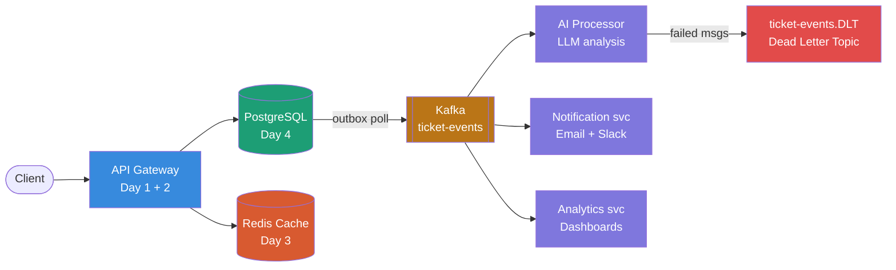
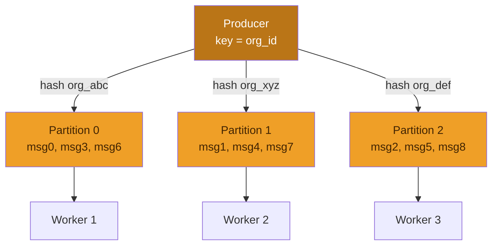
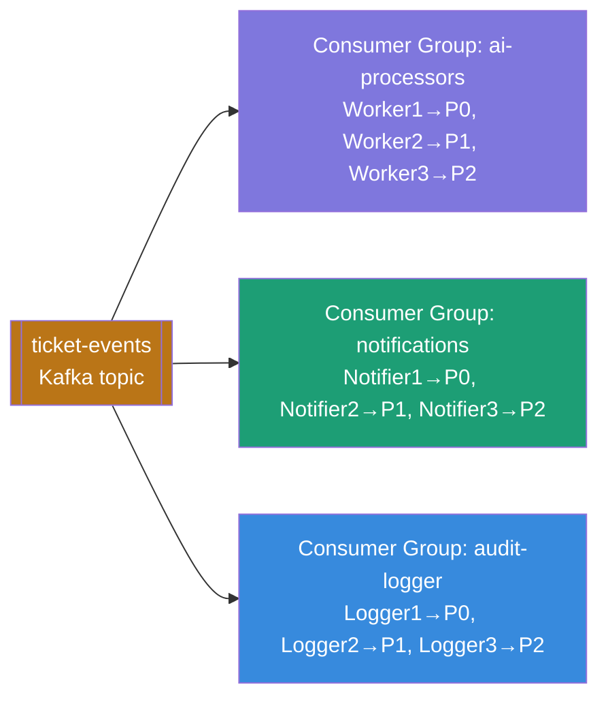
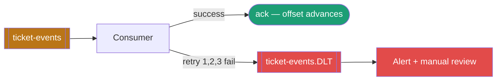
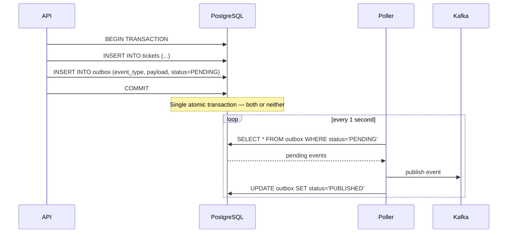

# Day 5 — Message Queues & Event-Driven Architecture

> **Learning approach:** Analogy first → Concept → Java + Node.js code → Interview Q&A
>
> **AESP context:** Kafka decouples ticket ingestion from AI processing, notifications, and analytics. One ticket creation event fans out to multiple independent consumers — no service waits on another.

---

## The analogy

Think of a busy restaurant kitchen. The waiter (your API) takes an order and immediately drops a ticket on the **order rail**. The waiter doesn't stand watching the chef cook — they go back and serve more customers. When food is ready, the kitchen bell rings. That order rail is your **message queue**.

| Without queue | With queue |
|---|---|
| Waiter waits at kitchen window for 20 min | Waiter takes 50 orders, kitchen processes at its own pace |
| 5 customers served per hour | 200 customers served per hour |
| API times out waiting for AI response | API returns immediately, AI processes async |

This is the heart of event-driven architecture — **decouple the producer of work from the consumer of work**.

---

## Queue vs topic — the critical distinction

| | Queue (point-to-point) | Topic (pub/sub) |
|---|---|---|
| Consumers | One consumer gets each message | All consumers get every message |
| Use case | Distribute work across workers | Broadcast event to all interested services |
| Example | 5 AI workers splitting 100 ticket tasks | Ticket created → notify + analyze + audit all at once |
| Tools | RabbitMQ, SQS, ActiveMQ | Kafka, SNS, Google Pub/Sub |
| Message fate | Deleted after consumed | Retained — consumers track their own offset |

**AESP uses both:** Kafka topics for event broadcasting (one ticket event → multiple consumers). Work queues for AI task distribution (100 tickets ÷ 5 AI workers = 20 each).

---

## System overview



> Every concept from Days 1–5 appears here. API design (Day 1), rate limiting (Day 2), Redis deduplication (Day 3), PostgreSQL with outbox (Day 4), Kafka tying everything together (Day 5).

---

## Why Kafka specifically?

Kafka is not just a queue — it is a **distributed commit log**. Every message is stored on disk with an offset. Consumers track their own position independently.

```
Traditional queue (RabbitMQ):
  Producer → [msg] → Queue → Consumer → msg DELETED

Kafka topic:
  Producer → [msg0][msg1][msg2][msg3][msg4] → Partition (retained on disk)
                                                    ↑           ↑
                                             Consumer A     Consumer B
                                             offset: 3      offset: 1
                                             (independent)  (independent)
```

This means:
- A consumer can re-read messages from any point in history
- Adding a new consumer service does not affect existing ones
- A crashed consumer resumes from its last committed offset
- Messages are retained for days or weeks — not deleted on consume

---

## Kafka deep dive

### Partitions — the key to parallelism

A Kafka topic is divided into partitions. Messages with the same key always go to the same partition (ordering preserved). Different partitions are processed in parallel by different consumers.



> Rule: you cannot have more consumers in a group than partitions. Extra consumers sit idle.

### Consumer groups — scale without duplication



> All three groups receive **all** messages. Within each group, work is divided across partitions. Adding a new consumer group is zero-impact on existing groups.

---

## Implementation

### Java: Kafka producer (Spring Boot)

```java
@Service
public class TicketEventProducer {

    private final KafkaTemplate<String, TicketEvent> kafkaTemplate;
    private static final String TOPIC = "ticket-events";

    public void publishTicketCreated(Ticket ticket) {
        TicketEvent event = TicketEvent.builder()
            .eventType("TICKET_CREATED")
            .ticketId(ticket.getId())
            .orgId(ticket.getOrgId())
            .priority(ticket.getPriority())
            .subject(ticket.getSubject())
            .timestamp(Instant.now())
            .build();

        // Key = orgId → same org's tickets always go to same partition (ordered)
        kafkaTemplate.send(TOPIC, ticket.getOrgId(), event)
            .whenComplete((result, ex) -> {
                if (ex != null) {
                    log.error("Failed to publish ticket event: {}", ticket.getId(), ex);
                } else {
                    log.info("Published ticket event: offset={}",
                        result.getRecordMetadata().offset());
                }
            });
    }
}
```

### Java: Kafka consumer (AI processor)

```java
@Service
public class AiTicketProcessor {

    @KafkaListener(
        topics = "ticket-events",
        groupId = "ai-processors",
        concurrency = "3"    // 3 threads = 3 partition consumers
    )
    public void processTicketEvent(
            TicketEvent event,
            Acknowledgment ack,
            @Header(KafkaHeaders.RECEIVED_PARTITION) int partition,
            @Header(KafkaHeaders.OFFSET) long offset) {

        log.info("Processing ticket {} from partition={} offset={}",
            event.getTicketId(), partition, offset);

        try {
            if ("TICKET_CREATED".equals(event.getEventType())) {
                AiAnalysis analysis = aiService.analyzeTicket(event);
                ticketService.updateWithAiAnalysis(event.getTicketId(), analysis);
            }
            ack.acknowledge();  // Manual ack — only commit offset after success

        } catch (RetryableException e) {
            // Don't ack — Kafka will redeliver
            throw e;
        } catch (PermanentException e) {
            // Send to dead letter topic, then ack to move forward
            deadLetterProducer.send("ticket-events.DLT", event);
            ack.acknowledge();
        }
    }
}
```

### Java: application.yml (Kafka config)

```yaml
spring:
  kafka:
    bootstrap-servers: localhost:9092
    producer:
      key-serializer: org.apache.kafka.common.serialization.StringSerializer
      value-serializer: org.springframework.kafka.support.serializer.JsonSerializer
      acks: all                    # Wait for all replicas — strongest durability
      retries: 3
      properties:
        enable.idempotence: true   # Exactly-once producer semantics
    consumer:
      group-id: ai-processors
      key-deserializer: org.apache.kafka.common.serialization.StringDeserializer
      value-deserializer: org.springframework.kafka.support.serializer.JsonDeserializer
      auto-offset-reset: earliest  # New consumer group starts from beginning
      enable-auto-commit: false    # Manual ack — we control offset commits
      properties:
        spring.json.trusted.packages: "com.aesp.events"
    listener:
      ack-mode: MANUAL_IMMEDIATE
```

### Node.js: producer (kafkajs)

```javascript
const { Kafka } = require('kafkajs');

const kafka = new Kafka({ brokers: ['localhost:9092'] });
const producer = kafka.producer({ idempotent: true });

async function publishTicketEvent(ticket) {
  await producer.connect();

  await producer.send({
    topic: 'ticket-events',
    messages: [{
      key: ticket.orgId,           // Same org → same partition → ordered
      value: JSON.stringify({
        eventType: 'TICKET_CREATED',
        ticketId: ticket.id,
        orgId: ticket.orgId,
        priority: ticket.priority,
        subject: ticket.subject,
        timestamp: new Date().toISOString(),
      }),
      headers: { source: 'api-gateway', version: '1' }
    }]
  });
}
```

### Node.js: consumer (AI processor)

```javascript
const consumer = kafka.consumer({ groupId: 'ai-processors' });

async function startAiProcessor() {
  await consumer.connect();
  await consumer.subscribe({ topic: 'ticket-events', fromBeginning: false });

  await consumer.run({
    eachMessage: async ({ topic, partition, message }) => {
      const event = JSON.parse(message.value.toString());

      console.log(`Processing ticket ${event.ticketId} 
        partition=${partition} offset=${message.offset}`);

      try {
        if (event.eventType === 'TICKET_CREATED') {
          const analysis = await aiService.analyzeTicket(event);
          await ticketService.updateWithAiAnalysis(event.ticketId, analysis);
        }
        // kafkajs auto-commits after eachMessage resolves
      } catch (err) {
        if (isPermanentError(err)) {
          await deadLetterProducer.send('ticket-events.DLT', event);
          // Don't throw — let offset advance past this message
        } else {
          throw err; // Retryable — kafkajs retries from same offset
        }
      }
    }
  });
}
```

---

## Critical patterns

### 1. Dead letter queue (DLT)



When a message fails after all retries, send it to the DLT instead of blocking the partition. A separate process monitors and alerts on DLT messages for manual investigation.

### 2. Outbox pattern — guaranteed event publishing

The biggest bug in event-driven systems: you save to the DB and publish to Kafka separately. If Kafka is down, the event is lost forever.



```java
@Transactional
public void createTicket(TicketRequest req) {
    Ticket ticket = ticketRepo.save(req.toTicket());

    // Write event to outbox IN THE SAME TRANSACTION
    outboxRepo.save(OutboxEvent.builder()
        .aggregateId(ticket.getId())
        .eventType("TICKET_CREATED")
        .payload(serialize(ticket))
        .status("PENDING")
        .build());
    // Either both commit or both rollback — Kafka is never involved here
}

@Scheduled(fixedDelay = 1000)
public void pollOutbox() {
    outboxRepo.findByStatus("PENDING").forEach(event -> {
        kafkaTemplate.send(event.toKafkaMessage());
        event.setStatus("PUBLISHED");
        outboxRepo.save(event);
    });
}
```

### 3. Idempotent consumer — handle duplicates safely

Kafka guarantees **at-least-once** delivery. A consumer crash before committing its offset means the same message is redelivered. Always handle duplicates:

```java
@KafkaListener(topics = "ticket-events", groupId = "ai-processors")
public void process(TicketEvent event, Acknowledgment ack) {
    String idempotencyKey = "ai-processed:" + event.getTicketId();

    // Already processed? Skip.
    if (redis.exists(idempotencyKey)) {
        log.info("Duplicate event, skipping: {}", event.getTicketId());
        ack.acknowledge();
        return;
    }

    aiService.analyzeTicket(event);

    // Mark as processed with 7-day TTL
    redis.setex(idempotencyKey, 604800, "done");
    ack.acknowledge();
}
```

---

## Kafka vs RabbitMQ vs SQS

| | Kafka | RabbitMQ | AWS SQS |
|---|---|---|---|
| Model | Distributed log | Message broker | Managed queue |
| Throughput | Millions/sec | Thousands/sec | Thousands/sec |
| Message retention | Days / weeks | Until consumed | Until consumed (14 day max) |
| Replay | Yes — any offset | No | No |
| Ordering | Per partition | Per queue | FIFO queues only |
| Complexity | High (ops burden) | Medium | Low (fully managed) |
| Best for | High throughput, event sourcing, replay | Complex routing, RPC patterns | Simple tasks, AWS ecosystem |
| AESP choice | ticket-events, AI pipeline | Internal service RPC | Not used |

---

## Interview Q&A

**Q: "How does Kafka guarantee message ordering?"**

> Kafka guarantees ordering only within a single partition. Messages with the same key always route to the same partition, so all events for a given `org_id` arrive in order. Across partitions there is no global ordering. If you need strict global order for a single entity — say, all state changes for one ticket — use the ticket ID as the key so all its events land in the same partition. In AESP, keying by `org_id` means all of one organization's events are ordered, which is what matters for their support workflow.

**Q: "Explain at-least-once vs exactly-once delivery."**

> At-least-once: the broker guarantees every message is delivered, but a consumer crash before committing its offset causes redelivery. Your consumer must be idempotent. Exactly-once: Kafka supports this with `enable.idempotence=true` on the producer and transactional APIs on the consumer — the message write and offset commit happen atomically. It is more complex and slightly slower. For AESP's AI processor, at-least-once with Redis deduplication is the right tradeoff — simpler, and a duplicate AI analysis that detects the idempotency key and skips processing is a no-op.

**Q: "What is the outbox pattern and why do you need it?"**

> Without outbox, publishing a Kafka event after a DB write creates a two-phase commit problem: if Kafka is down, your ticket is saved but the event is lost — downstream services never know. The outbox pattern writes the event to a DB table in the same transaction as the business record. A poller reads pending rows and publishes to Kafka, retrying until it succeeds. The DB transaction is the source of truth. Guaranteed delivery with no distributed transaction required.

**Q: "How would you handle a Kafka consumer that is falling behind?"**

> First, measure lag — the difference between the latest offset and the consumer's committed offset. If lag is growing: (1) add more consumer instances up to the partition count; (2) increase partition count if already at the consumer limit; (3) profile the consumer — if the LLM call is slow, process messages in async batches; (4) check whether the producer is producing faster than expected and add backpressure; (5) for bursty workloads, consider a two-stage pipeline — Kafka consumer writes to a work queue, a pool of workers processes independently at maximum parallelism.

**Q: "When would you choose RabbitMQ over Kafka?"**

> RabbitMQ when you need complex routing — topic exchanges, header-based routing, fanout with dead-letter re-queuing — and your volume is thousands per second, not millions. Also when you need request-reply (RPC) patterns where a service sends a message and waits for a correlated response. Kafka when you need high throughput, message replay, event sourcing, or multiple independent consumer groups reading the same stream. Kafka's operational complexity is only worth it above ~50k messages/second or when replay is a hard requirement.

---

## Phase 1 complete — what you have built

| Day | Topic | AESP component built |
|---|---|---|
| 1 | APIs — REST / GraphQL / gRPC | API Gateway, service contracts |
| 2 | Load balancing + rate limiting | Traffic management, DDoS protection |
| 3 | Caching — eviction, write strategies | Redis session + RAG response cache |
| 4 | Databases — indexing, sharding, replication | PostgreSQL ticket store, read replicas |
| 5 | Message queues — Kafka, patterns | Async AI pipeline, event-driven services |

**Phase 2 next:** AI and RAG Integration — where your enterprise backend skills meet LLMs, embeddings, vector databases, and the RAG pipeline that makes AESP intelligent.

---

## Day 5 checklist

- [ ] Explain queue vs topic (point-to-point vs pub/sub) with examples
- [ ] Explain Kafka partitions, offsets, and consumer groups from memory
- [ ] Write a Spring Boot Kafka producer with proper error handling
- [ ] Write a Spring Boot Kafka consumer with manual acknowledgment
- [ ] Implement the outbox pattern — explain why it is needed
- [ ] Implement idempotent consumer with Redis deduplication
- [ ] Explain at-least-once vs exactly-once delivery
- [ ] Choose between Kafka, RabbitMQ, and SQS for a given scenario
- [ ] Describe how to handle a consumer that is falling behind (lag)
