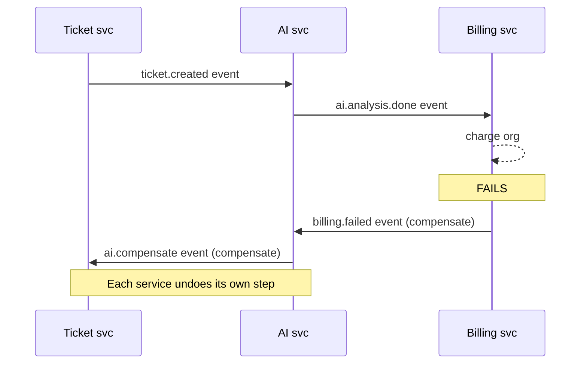
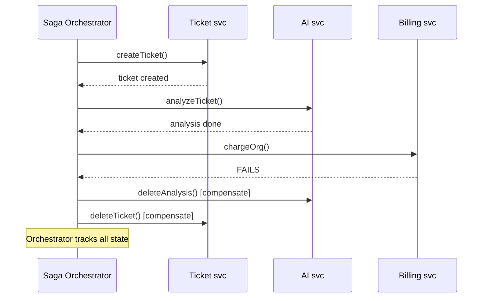
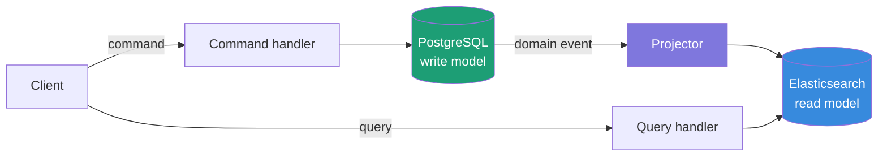
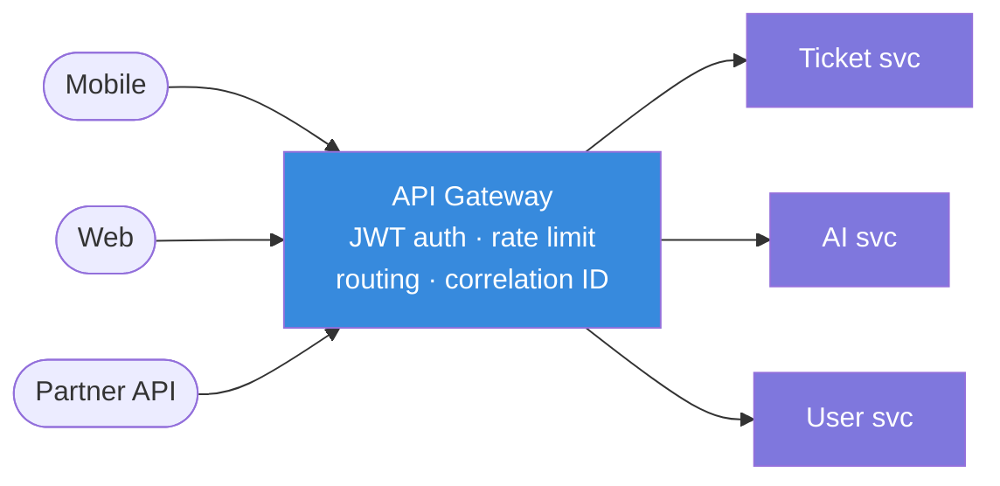
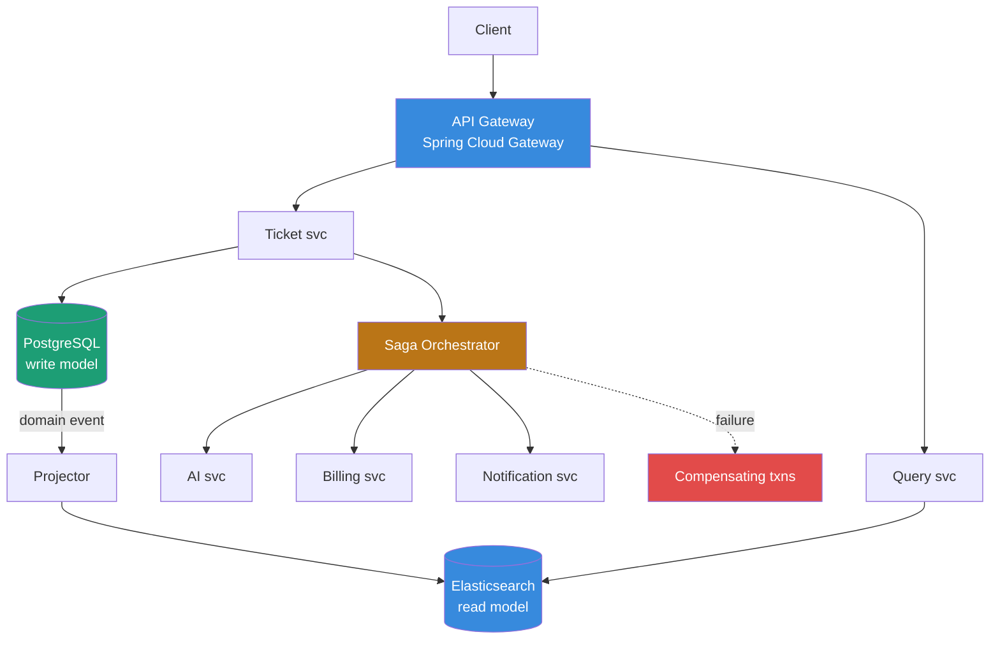

# Day 6 — Microservices Patterns: Saga, CQRS, Service Mesh & API Gateway

> **Learning approach:** Analogy first → Concept → Java + Node.js code → Interview Q&A
>
> **AESP context:** AESP is decomposed into independent services — ticket, AI, billing, notification. These patterns coordinate them safely, scale them independently, and keep them observable.

---

## The analogy

A single restaurant starts small — one kitchen does everything. Then the chain grows to 500 locations. One central kitchen handling every order for every location is a disaster. So you split: each location has its own kitchen (microservice). But now coordinating a customer order across 3 kitchens is complex. What if kitchen 2 fails midway? That is where Saga, CQRS, and service mesh come in.

---

## Pattern 1 — Saga: distributed transactions without 2PC

Two-phase commit (2PC) locks all services until a coordinator decides commit or rollback. In microservices this blocks resources across service boundaries and creates tight coupling. Saga replaces the global lock with a sequence of local transactions. If any step fails, **compensating transactions** undo previous steps in reverse order.

### Choreography vs orchestration

| | Choreography | Orchestration |
|---|---|---|
| Who coordinates? | Services react to each other's events | A central orchestrator directs each step |
| Coupling | Loose — services don't know each other | Tighter — orchestrator knows all services |
| Failure visibility | Hard — must trace events across services | Easy — orchestrator tracks full state |
| Best for | Simple flows, few services | Complex flows, many steps |
| Tools | Kafka events | Temporal, Spring State Machine, Conductor |

### Choreography flow



### Orchestration flow (AESP approach)



### Java: saga orchestrator

```java
@Service
public class TicketCreationSaga {

    public SagaResult execute(CreateTicketCommand cmd) {
        SagaContext ctx = SagaContext.start(cmd.getCorrelationId());

        try {
            // Step 1: Create ticket
            Ticket ticket = ticketService.createTicket(cmd);
            ctx.addCompensation(() -> ticketService.deleteTicket(ticket.getId()));

            // Step 2: AI analysis
            AiAnalysis analysis = aiService.analyzeTicket(ticket);
            ctx.addCompensation(() -> aiService.deleteAnalysis(analysis.getId()));

            // Step 3: Charge org for AI usage
            billingService.chargeForAiUsage(cmd.getOrgId(), analysis.getTokensUsed());
            ctx.addCompensation(() -> billingService.refund(cmd.getOrgId()));

            // Step 4: Notify (no compensation — notification already sent)
            notificationService.notifyTicketCreated(ticket);

            ctx.complete();
            return SagaResult.success(ticket);

        } catch (Exception e) {
            ctx.compensate(); // Runs in REVERSE order (LIFO)
            return SagaResult.failure(e.getMessage());
        }
    }
}

public class SagaContext {
    private final Deque<Runnable> compensations = new ArrayDeque<>();

    public void addCompensation(Runnable action) {
        compensations.push(action); // push = LIFO
    }

    public void compensate() {
        compensations.forEach(action -> {
            try { action.run(); }
            catch (Exception e) {
                log.error("Compensation failed — needs manual intervention", e);
            }
        });
    }
}
```

### Node.js: saga orchestrator

```javascript
class TicketCreationSaga {
  async execute(cmd) {
    const compensations = [];

    try {
      const ticket = await ticketService.create(cmd);
      compensations.unshift(() => ticketService.delete(ticket.id));

      const analysis = await aiService.analyze(ticket);
      compensations.unshift(() => aiService.deleteAnalysis(analysis.id));

      await billingService.charge(cmd.orgId, analysis.tokensUsed);
      compensations.unshift(() => billingService.refund(cmd.orgId));

      await notificationService.notifyCreated(ticket);
      return { success: true, ticket };

    } catch (err) {
      for (const compensate of compensations) {
        try { await compensate(); }
        catch (e) { log.error('Compensation failed — manual intervention needed', e); }
      }
      return { success: false, error: err.message };
    }
  }
}
```

---

## Pattern 2 — CQRS: separate reads from writes

CQRS (Command Query Responsibility Segregation) uses different models for writes and reads. Commands change state against a normalized write store. Queries read from a denormalized, search-optimized read store. The projector keeps them in sync via domain events.

### Architecture



### Java: command handler, projector, query handler

```java
// ── COMMAND SIDE ──────────────────────────────────────────────────────────────

public record CreateTicketCommand(
    String orgId, String userId, String subject, int priority) {}

@Service
public class TicketCommandHandler {
    private final TicketRepository repo;
    private final ApplicationEventPublisher events;

    public Ticket handle(CreateTicketCommand cmd) {
        Ticket ticket = Ticket.create(cmd);
        repo.save(ticket);
        events.publishEvent(new TicketCreatedEvent(ticket)); // triggers projector
        return ticket;
    }
}

// ── PROJECTOR ─────────────────────────────────────────────────────────────────

@Component
public class TicketProjector {
    private final ElasticsearchClient esClient;

    @EventListener
    public void on(TicketCreatedEvent event) {
        Ticket t = event.getTicket();

        // Denormalized — everything a dashboard needs in one document, no JOIN
        TicketDocument doc = TicketDocument.builder()
            .id(t.getId())
            .orgId(t.getOrgId())
            .orgName(t.getOrg().getName())     // denormalized
            .userId(t.getUserId())
            .userName(t.getUser().getName())   // denormalized
            .subject(t.getSubject())
            .status(t.getStatus())
            .priority(t.getPriority())
            .createdAt(t.getCreatedAt())
            .build();

        esClient.index(i -> i.index("tickets").id(doc.getId()).document(doc));
    }
}

// ── QUERY SIDE ────────────────────────────────────────────────────────────────

@Service
public class TicketQueryHandler {
    private final ElasticsearchClient esClient;

    public TicketSearchResult handle(SearchTicketsQuery query) {
        // Never touches PostgreSQL — reads Elasticsearch only
        return esClient.search(s -> s
            .index("tickets")
            .query(q -> q.bool(b -> b
                .must(m -> m.term(t -> t.field("orgId").value(query.orgId())))
                .must(m -> m.match(mt -> mt.field("subject").query(query.text())))
                .filter(f -> f.term(t -> t.field("status").value(query.status())))
            ))
            .sort(so -> so.field(f -> f.field("createdAt").order(SortOrder.Desc)))
            .size(query.pageSize()),
            TicketDocument.class
        );
    }
}
```

### Node.js: CQRS

```javascript
// Command handler — writes to PostgreSQL
async function handleCreateTicket(cmd) {
  const ticket = await db('tickets').insert({
    org_id: cmd.orgId, user_id: cmd.userId,
    subject: cmd.subject, status: 'open', priority: cmd.priority,
  }).returning('*');

  await eventBus.emit('ticket.created', ticket[0]);
  return ticket[0];
}

// Projector — builds denormalized Elasticsearch document
eventBus.on('ticket.created', async (ticket) => {
  const [user, org] = await Promise.all([
    db('users').where({ id: ticket.user_id }).first(),
    db('orgs').where({ id: ticket.org_id }).first(),
  ]);

  await esClient.index({
    index: 'tickets',
    id: ticket.id,
    document: { ...ticket, userName: user.name, orgName: org.name }
  });
});

// Query handler — reads Elasticsearch only
async function searchTickets(query) {
  const result = await esClient.search({
    index: 'tickets',
    query: {
      bool: {
        must:   [{ match: { subject: query.text } }],
        filter: [{ term: { org_id: query.orgId } }, { term: { status: query.status } }]
      }
    },
    sort: [{ created_at: 'desc' }],
    size: query.pageSize
  });
  return result.hits.hits.map(h => h._source);
}
```

---

## Pattern 3 — Service mesh: observability and resilience without code

A service mesh (Istio, Linkerd) injects a sidecar proxy alongside every pod. The proxy intercepts all network traffic and enforces: mTLS, retries, circuit breaking, timeouts, and distributed tracing — without any application code changes.

```
Without mesh:
  Each service implements retry, timeout, circuit breaker, TLS separately
  → duplicated across every service, inconsistent, easy to forget

With Istio:
  Service A → [Envoy sidecar] ──mTLS──► [Envoy sidecar] → Service B
                    ↑                           ↑
             auto retry, circuit          metrics, traces
             break, timeout               injected automatically
```

### AESP Istio config

```yaml
apiVersion: networking.istio.io/v1alpha3
kind: VirtualService
metadata:
  name: ai-service
spec:
  hosts:
    - ai-service
  http:
    - route:
        - destination:
            host: ai-service
            port:
              number: 8080
      timeout: 30s               # LLM calls can be slow
      retries:
        attempts: 3
        perTryTimeout: 10s
        retryOn: gateway-error,reset,connect-failure

---
apiVersion: networking.istio.io/v1alpha3
kind: DestinationRule
metadata:
  name: ai-service-circuit-breaker
spec:
  host: ai-service
  trafficPolicy:
    outlierDetection:
      consecutiveErrors: 5       # Trip after 5 consecutive errors
      interval: 30s
      baseEjectionTime: 30s      # Eject pod for 30s then retry
      maxEjectionPercent: 50     # Never eject more than 50% of pods
```

---

## Pattern 4 — API gateway pattern

The API Gateway is the single entry point for all clients. It centralizes cross-cutting concerns that would otherwise be duplicated in every service.



| Concern | Without gateway | With gateway |
|---|---|---|
| JWT validation | Every service validates tokens | Gateway validates once, passes user context |
| Rate limiting | Every service implements Redis limiter | Gateway enforces globally |
| SSL termination | Every service manages certificates | Gateway terminates TLS |
| Routing | Client knows every service URL | Client only knows gateway URL |
| Logging | Each service logs differently | Gateway injects correlation ID on every request |
| Circuit breaking | Each service implements independently | Gateway enforces for all upstream services |

### Java: Spring Cloud Gateway (AESP)

```java
@Configuration
public class GatewayConfig {

    @Bean
    public RouteLocator routes(RouteLocatorBuilder builder) {
        return builder.routes()

            .route("ticket-service", r -> r
                .path("/api/v1/tickets/**")
                .filters(f -> f
                    .filter(jwtAuthFilter())
                    .filter(rateLimitFilter())
                    .addRequestHeader("X-User-Id", "#{@jwtParser.getUserId()}")
                    .addRequestHeader("X-Org-Id",  "#{@jwtParser.getOrgId()}")
                    .retry(c -> c.setRetries(2).setStatuses(HttpStatus.BAD_GATEWAY))
                )
                .uri("lb://ticket-service"))

            // AI routes — stricter rate limit (expensive GPU calls)
            .route("ai-service", r -> r
                .path("/api/v1/ai/**")
                .filters(f -> f
                    .filter(jwtAuthFilter())
                    .filter(aiRateLimitFilter())   // 10 req/min vs 100 for regular
                    .circuitBreaker(c -> c
                        .setName("ai-circuit-breaker")
                        .setFallbackUri("forward:/fallback/ai"))
                )
                .uri("lb://ai-service"))

            .build();
    }
}
```

---

## Full AESP microservices architecture



> All inter-service calls pass through Istio sidecar proxies — mTLS, retries, circuit breaking, and distributed traces come for free with zero application code changes.

---

## Interview Q&A

**Q: "What problem does the Saga pattern solve? Why not use 2PC?"**

> Two-phase commit locks resources across all participating services until a coordinator decides commit or rollback. In a microservices environment this means service A holds a DB lock waiting for service B — if B is slow or down, A blocks all other requests. 2PC also tightly couples all services to the coordinator. Saga replaces the global lock with a sequence of local transactions. Each service commits immediately and publishes an event. If any step fails, compensating transactions undo previous steps in reverse order. No global lock, no coordinator dependency. The tradeoff: eventual consistency — there is a window where the system is partially updated.

**Q: "When would you use CQRS and when would you avoid it?"**

> Use CQRS when read and write patterns are fundamentally different — different data shapes, performance characteristics, and scaling needs. AESP tickets: writes are normalized ACID operations, reads are full-text search across denormalized documents. Also use CQRS when read traffic massively outscales writes — scale the read side (Elasticsearch nodes) independently of the write side (PostgreSQL). Avoid CQRS for simple CRUD — it adds projectors, two data stores, and eventual consistency to manage. The signal: if your team asks "why are our read queries so complex for such simple writes?" CQRS is probably the answer.

**Q: "What is eventual consistency in CQRS and how do you handle it?"**

> After a write commits to PostgreSQL, the projector updates Elasticsearch asynchronously — this takes milliseconds to seconds. During that window, queries return stale data. Handle it with: (1) optimistic UI — update the screen immediately without waiting for the read model; (2) version tokens — include a version in the write response, the query waits until that version is projected; (3) read-your-own-writes — route the creator's first query to the write model for 2 seconds after a write; (4) document it clearly in your API contract: search results may lag up to 5 seconds.

**Q: "What does a service mesh give you that application code cannot?"**

> A service mesh enforces network policy uniformly across all services without developers adding retry, circuit breaker, or mTLS to every client. Additional benefits: mutual TLS between all services (zero-trust — no service can impersonate another), distributed tracing with zero instrumentation (sidecar injects trace headers automatically), real-time per-service-pair metrics (latency, error rates, saturation), and traffic shaping for canary deployments (route 5% of traffic to a new version). The key value is consistency — a developer writing a new service gets all of this for free by deploying into the mesh.

---

## Day 6 checklist

- [ ] Explain the Saga pattern — choreography vs orchestration with a concrete AESP example
- [ ] Implement a Saga orchestrator with compensating transactions in Java and Node.js
- [ ] Explain CQRS — what problem it solves, write model vs read model
- [ ] Implement command handler, projector, and query handler in Java
- [ ] Explain eventual consistency in CQRS and three strategies to handle it
- [ ] Describe what a service mesh does and why you would use Istio over application code
- [ ] Explain the API Gateway pattern and list 6 concerns it centralizes
- [ ] Draw the full AESP microservices architecture from memory
