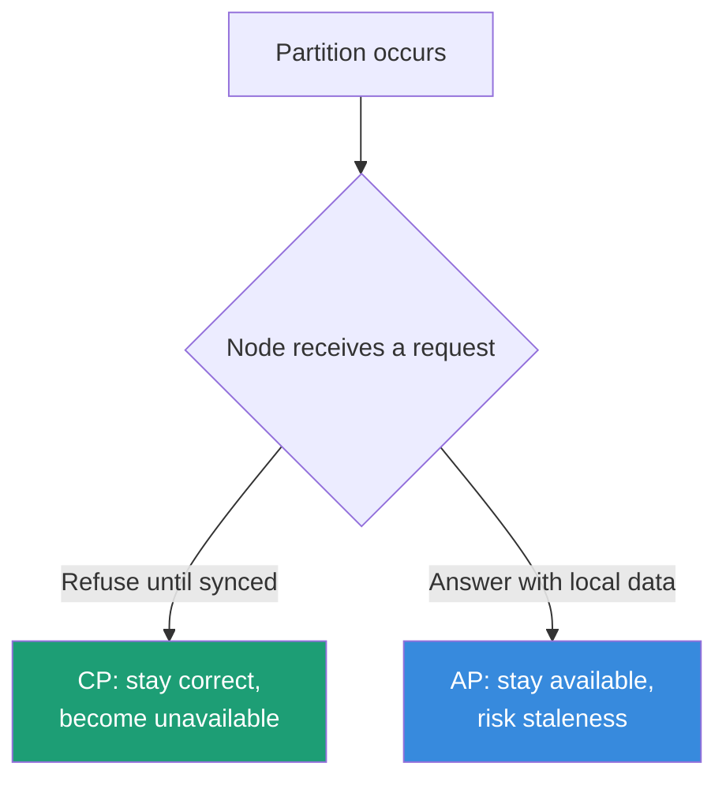
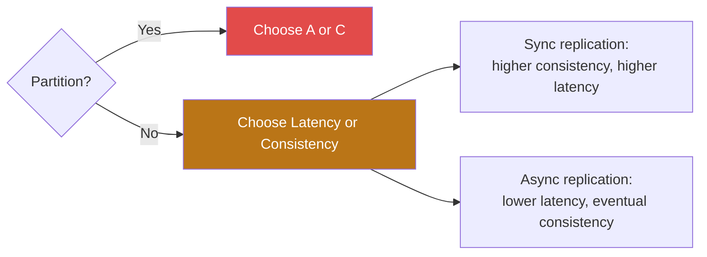
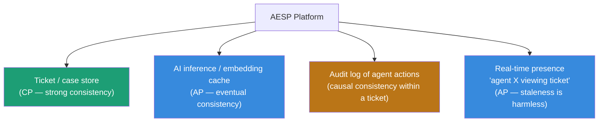

# Day 7 — CAP Theorem & Consistency Models

> **Learning approach:** Analogy first → Concept → Java + Node.js code → Interview Q&A
>
> **AESP context:** AESP's ticket store, AI cache, audit log, and presence features each sit on different points of the CP/AP spectrum. Knowing which is which — and why — is the core of this session.

---

## The analogy

A bank has branches in Hyderabad and New York, both holding the same customer's balance. A customer withdraws ₹50,000 in Hyderabad. At that exact moment the network link between the two cities drops. Someone checks their balance in New York. The branch has two choices: refuse to answer until it reconnects with Hyderabad (stay correct, become unavailable), or answer with what it last knew, possibly stale (stay available, risk being wrong). That choice — forced the instant the network partitions — is CAP theorem.

---

## CAP theorem, precisely

| Property | Meaning |
|---|---|
| **C — Consistency** | Every read receives the most recent write or an error. All nodes agree. |
| **A — Availability** | Every request gets a response (success or failure), no guarantee it's the latest data. |
| **P — Partition tolerance** | The system keeps operating despite dropped or delayed messages between nodes. |

**The theorem (Brewer, formalized by Gilbert & Lynch):** when a network partition occurs, you must choose between C and A. You cannot have both. Since partitions are a fact of life in any real multi-node system, the practical framing is **CP vs AP** — "pick 2 of 3" is a common but misleading simplification, because P isn't really optional.



### CP vs AP systems

| | CP | AP |
|---|---|---|
| Behavior during partition | Minority side stops serving requests | Every node keeps serving from local data |
| Examples | HBase, etcd, ZooKeeper, MongoDB (strong mode) | Cassandra, DynamoDB, CouchDB |
| Good for | Financial ledgers, inventory counts, leader election | Shopping carts, social feeds, session/presence data |
| Cost | Downtime risk during partitions | Conflicting writes need reconciliation later |

### Why "CA" isn't a real option

CA implies the system assumes the network never fails — true only for a single node. Any system with more than one node communicating over a real network will eventually see a partition, so CA only applies to non-distributed systems.

---

## Beyond CAP: consistency models

CAP only describes the binary partition case. In practice, consistency is a spectrum:

| Model | Guarantee | Cost |
|---|---|---|
| **Strong consistency** | Every read sees the latest write, full stop | Requires coordination (Raft/Paxos) → higher latency |
| **Eventual consistency** | Replicas converge *eventually* if writes stop | Fast, available, reads can be stale |
| **Causal consistency** | Causally related ops (A before B) seen in order by everyone; unrelated ops can reorder | Middle ground — partial coordination |
| **Read-your-writes** | A user always sees their own writes, even if others don't yet | Often solved via sticky sessions/routing, not full consensus |
| **Monotonic reads** | Once you've seen a value, you never see an older one later | Per-client guarantee, not global |

---

## PACELC — the more useful framing day to day

CAP only applies *during* a partition, which is relatively rare. **PACELC** extends it: *if Partitioned, choose Availability or Consistency; Else (no partition), choose Latency or Consistency.*



Most of the time your system isn't partitioned — so the latency/consistency tradeoff from synchronous vs asynchronous replication is the one you're actually living with daily, not the rare CAP scenario.

---

## Java: quorum-based read/write (the mechanism behind tunable consistency)

This is the actual engineering lever Cassandra/Dynamo-style systems expose: tuning write quorum (W) and read quorum (R) against replica count (N) decides where an operation sits on the CP↔AP spectrum.

```java
import java.util.*;
import java.util.concurrent.*;

public class QuorumConsistencyDemo {

    static class Node {
        String id;
        Map<String, VersionedValue> store = new ConcurrentHashMap<>();
        boolean reachable = true; // simulates a partition

        Node(String id) { this.id = id; }
    }

    record VersionedValue(String value, long timestamp) {}

    static class QuorumCluster {
        List<Node> nodes;
        int replicationFactor;
        int writeQuorum;  // W
        int readQuorum;   // R

        QuorumCluster(List<Node> nodes, int writeQuorum, int readQuorum) {
            this.nodes = nodes;
            this.replicationFactor = nodes.size();
            this.writeQuorum = writeQuorum;
            this.readQuorum = readQuorum;
            if (writeQuorum + readQuorum <= replicationFactor) {
                System.out.println("WARNING: W+R <= N -> eventual consistency only, stale reads possible");
            } else {
                System.out.println("W+R > N -> strong consistency guaranteed on quorum overlap");
            }
        }

        boolean write(String key, String value) {
            long ts = System.nanoTime();
            int acks = 0;
            for (Node n : nodes) {
                if (n.reachable) {
                    n.store.put(key, new VersionedValue(value, ts));
                    acks++;
                }
                if (acks >= writeQuorum) break;
            }
            boolean success = acks >= writeQuorum;
            System.out.printf("WRITE key=%s value=%s acks=%d/%d -> %s%n",
                    key, value, acks, writeQuorum, success ? "SUCCESS" : "FAILED (no quorum)");
            return success;
        }

        Optional<String> read(String key) {
            List<VersionedValue> responses = new ArrayList<>();
            for (Node n : nodes) {
                if (n.reachable && n.store.containsKey(key)) {
                    responses.add(n.store.get(key));
                }
                if (responses.size() >= readQuorum) break;
            }
            if (responses.size() < readQuorum) {
                System.out.println("READ FAILED: insufficient quorum (" + responses.size() + "/" + readQuorum + ")");
                return Optional.empty();
            }
            VersionedValue latest = responses.stream()
                    .max(Comparator.comparingLong(VersionedValue::timestamp))
                    .orElseThrow();
            System.out.println("READ key=" + key + " resolved value=" + latest.value());
            return Optional.of(latest.value());
        }
    }

    public static void main(String[] args) {
        List<Node> nodes = List.of(new Node("n1"), new Node("n2"), new Node("n3"));

        System.out.println("--- Strong consistency config (W=2, R=2, N=3) ---");
        QuorumCluster strongCluster = new QuorumCluster(nodes, 2, 2);
        strongCluster.write("balance:acct123", "5000");
        strongCluster.read("balance:acct123");

        System.out.println("\n--- Simulating partition: n3 unreachable ---");
        nodes.get(2).reachable = false;
        strongCluster.write("balance:acct123", "4500"); // still works, W=2 satisfied by n1,n2
        strongCluster.read("balance:acct123");           // still consistent, R=2 satisfied by n1,n2

        System.out.println("\n--- Eventual consistency config (W=1, R=1, N=3): fast but riskier ---");
        QuorumCluster apCluster = new QuorumCluster(nodes, 1, 1);
        apCluster.write("cart:user42", "item-A");
    }
}
```

---

## Node.js: eventual consistency with conflict reconciliation

Shows the other half of the tradeoff: AP systems get availability "for free" during a partition, but pay for it afterward with reconciliation logic.

```javascript
// eventualConsistency.js
// Simulates AP-style replicas that diverge during a partition, then reconcile.

class Replica {
  constructor(id) {
    this.id = id;
    this.data = new Map(); // key -> { value, vectorClock }
  }

  write(key, value, clockTick) {
    const existing = this.data.get(key);
    const vclock = existing ? { ...existing.vectorClock } : {};
    vclock[this.id] = (vclock[this.id] || 0) + 1;
    vclock._tick = clockTick;
    this.data.set(key, { value, vectorClock: vclock });
    console.log(`[${this.id}] WROTE ${key}=${value} clock=${JSON.stringify(vclock)}`);
  }

  read(key) {
    return this.data.get(key);
  }
}

function reconcile(replicas, key) {
  const versions = replicas
    .map(r => ({ replica: r.id, entry: r.read(key) }))
    .filter(v => v.entry);

  if (versions.length === 0) return null;

  // Last-write-wins via highest tick (simplified — real systems need full vector comparison)
  const winner = versions.reduce((a, b) =>
    a.entry.vectorClock._tick > b.entry.vectorClock._tick ? a : b
  );

  console.log(`RECONCILE ${key}: conflicting versions=${versions.length}, winner=${winner.replica} value=${winner.entry.value}`);

  // Propagate winner to all replicas (anti-entropy / read-repair)
  replicas.forEach(r => r.data.set(key, winner.entry));
  return winner.entry.value;
}

// --- Simulation ---
const replicaA = new Replica('A');
const replicaB = new Replica('B');
const cluster = [replicaA, replicaB];

console.log('--- Normal operation, both reachable ---');
replicaA.write('session:user7', 'page=home', 1);
replicaB.write('session:user7', 'page=home', 1);

console.log('\n--- Network partition: A and B isolated, both accept writes (AP behavior) ---');
replicaA.write('session:user7', 'page=cart', 2);     // user routed to A
replicaB.write('session:user7', 'page=checkout', 3); // same user, routed to B — conflicting write

console.log('\n--- Partition heals, anti-entropy process reconciles ---');
reconcile(cluster, 'session:user7');

console.log('\nFinal state:');
console.log('A:', replicaA.read('session:user7'));
console.log('B:', replicaB.read('session:user7'));
```

---

## AESP application

AESP doesn't pick CP or AP for the whole system — different components sit at different points on the spectrum, by design:



- **Ticket/case store (CP):** if an engineer closes a ticket, every other engineer querying it must see "closed," not a stale "open" status. Backed by PostgreSQL with synchronous replication or a CP-leaning store.
- **AI inference/embedding cache (AP):** a node serving a slightly stale cached suggestion for a few seconds is a fine tradeoff for never blocking the support engineer.
- **Audit/event log (causal):** ordering within one ticket's history must be preserved (action B that depends on action A can never appear before A), but cross-region eventual consistency for the overall log is acceptable.
- **Presence indicators (AP):** a second or two of staleness is harmless; the feature being *unavailable* during a network blip is what actually annoys users.

This gives a clean interview narrative: *"We don't pick CP or AP globally — we partition the problem by data type and apply the right consistency model to each."*

---

## Interview Q&A

**Q: "Can a system be both CP and AP?"**

> Not for the same piece of data during an actual partition — by definition you choose one. But systems can offer tunable consistency per operation (Cassandra's per-query consistency level: ONE, QUORUM, ALL), and different subsystems within one architecture can independently be CP or AP, as in the AESP ticket-store-vs-cache split.

**Q: "Why isn't CA a real option?"**

> CA assumes the network never partitions, which only holds for a single node. Any system with more than one node communicating over a real network will eventually see a partition, so CA effectively only applies to non-distributed systems.

**Q: "What's the difference between CAP and PACELC, and why does PACELC matter more in practice?"**

> CAP only describes behavior during a partition, a relatively rare event. PACELC also covers the normal, non-partitioned case, where synchronous replication still trades latency for consistency. Since most of the time the system isn't partitioned, the latency/consistency tradeoff is the one engineers actually tune day to day.

**Q: "Explain quorum consistency — what does W + R > N actually buy you?"**

> With N replicas, write quorum W, and read quorum R, if W + R > N then every read quorum is guaranteed to overlap with the most recent write quorum on at least one node, so a read can never miss the latest write. If W + R ≤ N, that overlap isn't guaranteed — reads can return stale data, but writes and reads complete faster since fewer nodes need to respond.

**Q: "How would you explain eventual consistency to a non-technical stakeholder?"**

> If you update your profile picture, your friends might see the old one for a few seconds before it updates everywhere — but the system stays fast and available the whole time instead of freezing while it makes sure everyone agrees instantly.

**Q: "Give a concrete example of read-your-writes consistency mattering."**

> A user posts a comment and immediately refreshes — they must see their own comment even if other users briefly don't. Usually solved by routing a user's reads to the same replica/region they wrote to (sticky routing), rather than requiring full strong consistency for everyone.

---

## Day 7 checklist

- [ ] Can state CAP theorem precisely: the choice is between C and A *during a partition* — P isn't optional
- [ ] Can name at least 2 real CP systems and 2 real AP systems with reasoning
- [ ] Understands quorum mechanics: W + R > N gives strong consistency, W + R ≤ N gives eventual
- [ ] Can explain PACELC and why it matters more day-to-day than CAP
- [ ] Can list at least 4 consistency models: strong, eventual, causal, read-your-writes/monotonic reads
- [ ] Mapped CAP tradeoffs onto at least 3 AESP components (ticket store, AI cache, audit log, presence)
- [ ] Ran both code samples and understood the quorum write/read flow and the conflict reconciliation flow
- [ ] Comfortable explaining eventual consistency to a non-technical audience in one sentence
